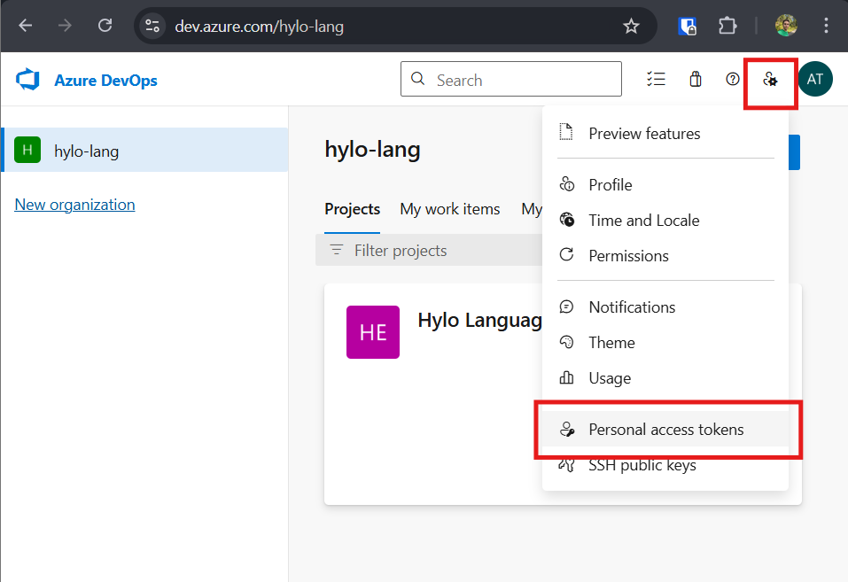

# Contributing

## Development

```
npm i
```

Try the extension: press `F5` or select `Run Extension` in the Run and Debug pane.

## Publishing

1. Create a Microsoft / VSCode marketplace account.
2. Ask for an invite for the `hylo-lang` Azure DevOps organization, and provide your user id.
3. Get publisher personal access token. https://dev.azure.com/hylo-lang/



4. `npx vsce publish` - paste your personal access token when being asked.

More info: https://code.visualstudio.com/api/working-with-extensions/publishing-extension
